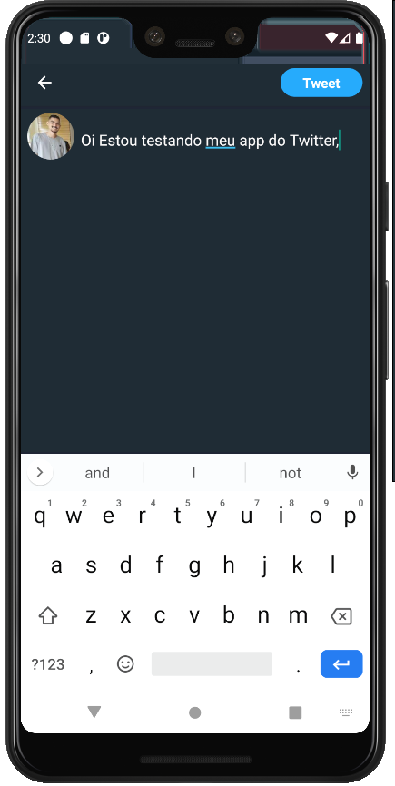

<h1 align="center">
    
</h1>

<h3 align="center">
  💙 Clone Twitter 🎉
</h3>

  <a href="#rocket-sobre-o-desafio">Sobre</a>&nbsp;&nbsp;&nbsp;|&nbsp;&nbsp;&nbsp;
  <a href='#gear-oque-foi-utilizado'>Oque foi utilizado</a>&nbsp;&nbsp;&nbsp;|&nbsp;&nbsp;&nbsp;
  <a href="#camera-imagens">Imagens</a>&nbsp;&nbsp;&nbsp;|&nbsp;&nbsp;&nbsp;
  <a href="#Instalar e usar">Instalar e usar</a>

## 💙 Sobre

Clone do feed e do box para escrever novos tweets utilizando <strong>React Native</strong>, utilizando redux e redux-persist para realizar a atualização do feed e salvar os novos tweets.

## ⚙️ Oque foi utilizado

- React
- React Native
- Redux
- React hooks
- React Navigation
- styled-components
- react-native-vector-icons

## 📷 Imagens

  
   
  
   
  
   

## 🚀 Instalar e usar

###### Clone o respostiorio.

`git@github.com:nelsonplinio/Twitter-React-Native.git`

###### Instalar as dependencias.

`cd Twitter-React-Native`
`yarn ou npm install`

###### Instalar as dependencias.

`yarn android ou yarn ios`
